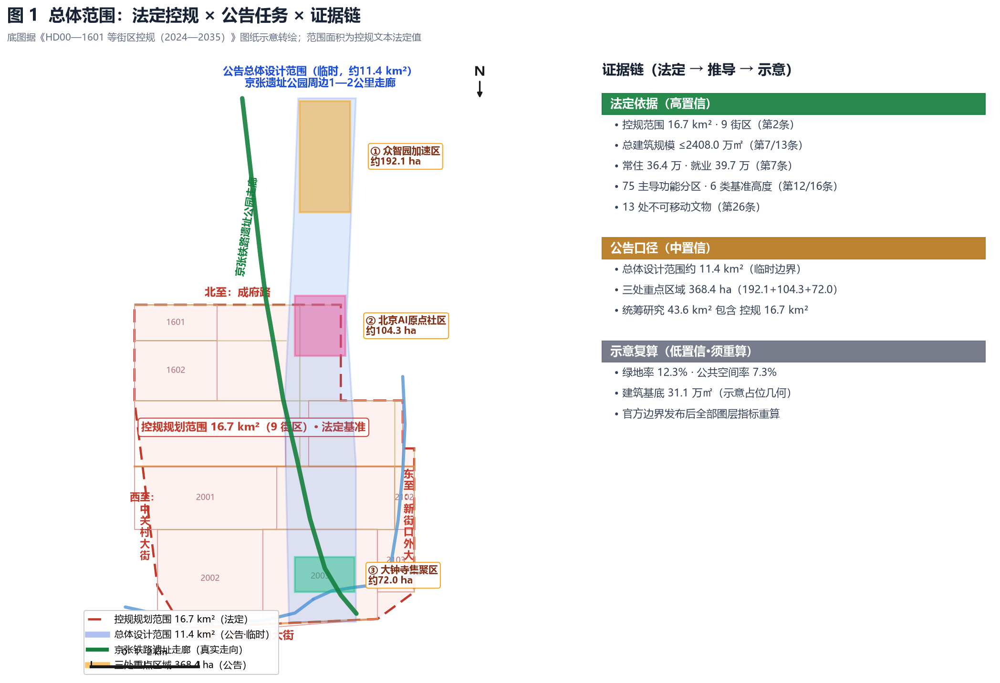
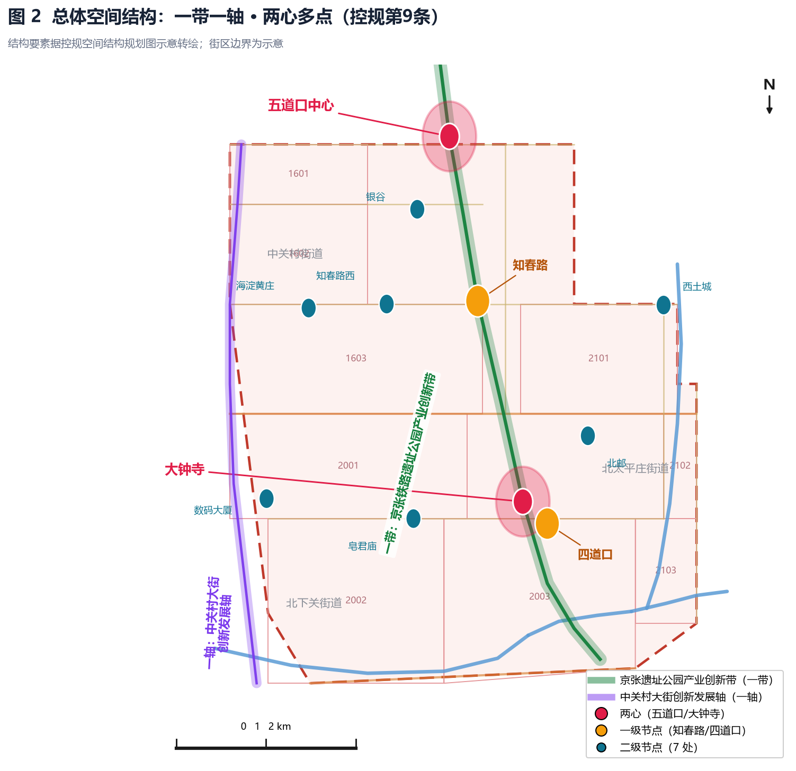
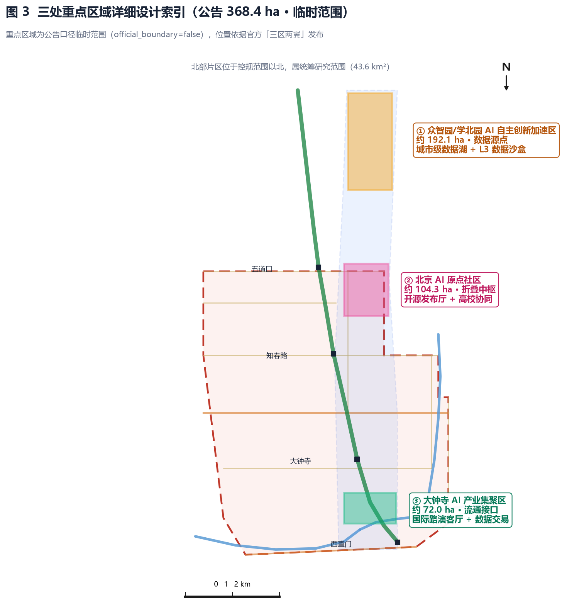
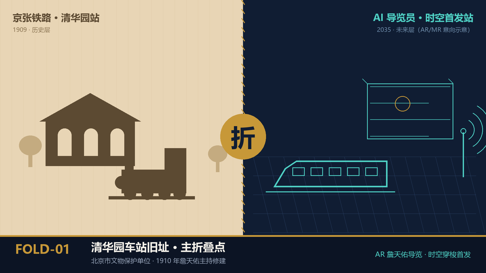
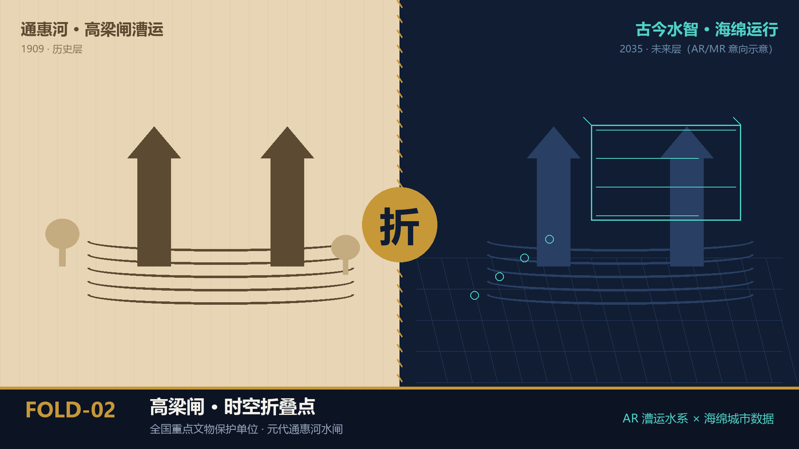
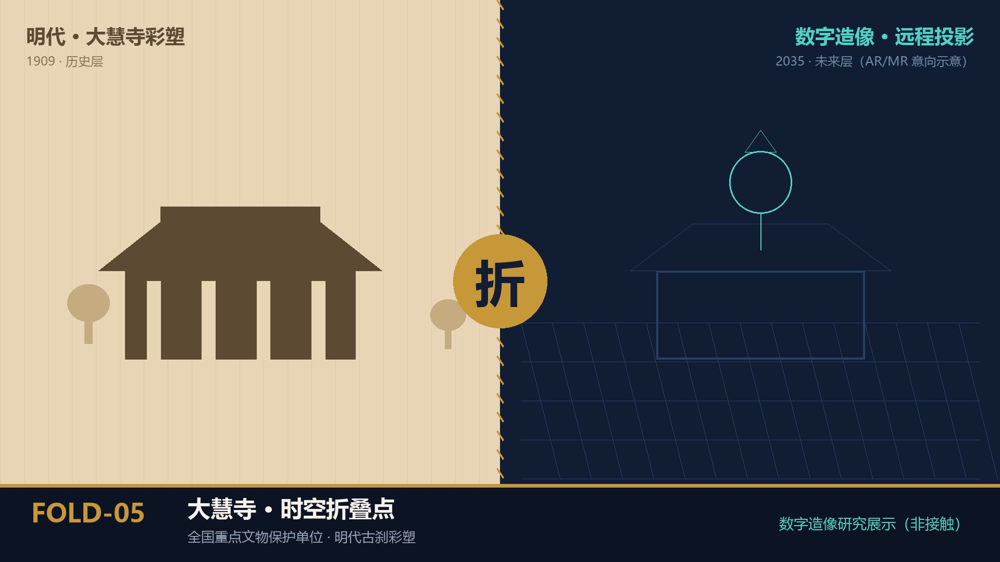
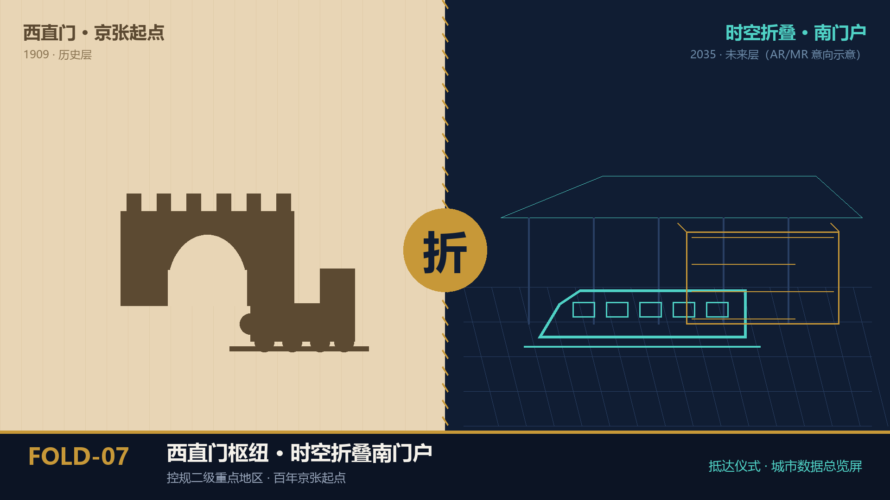
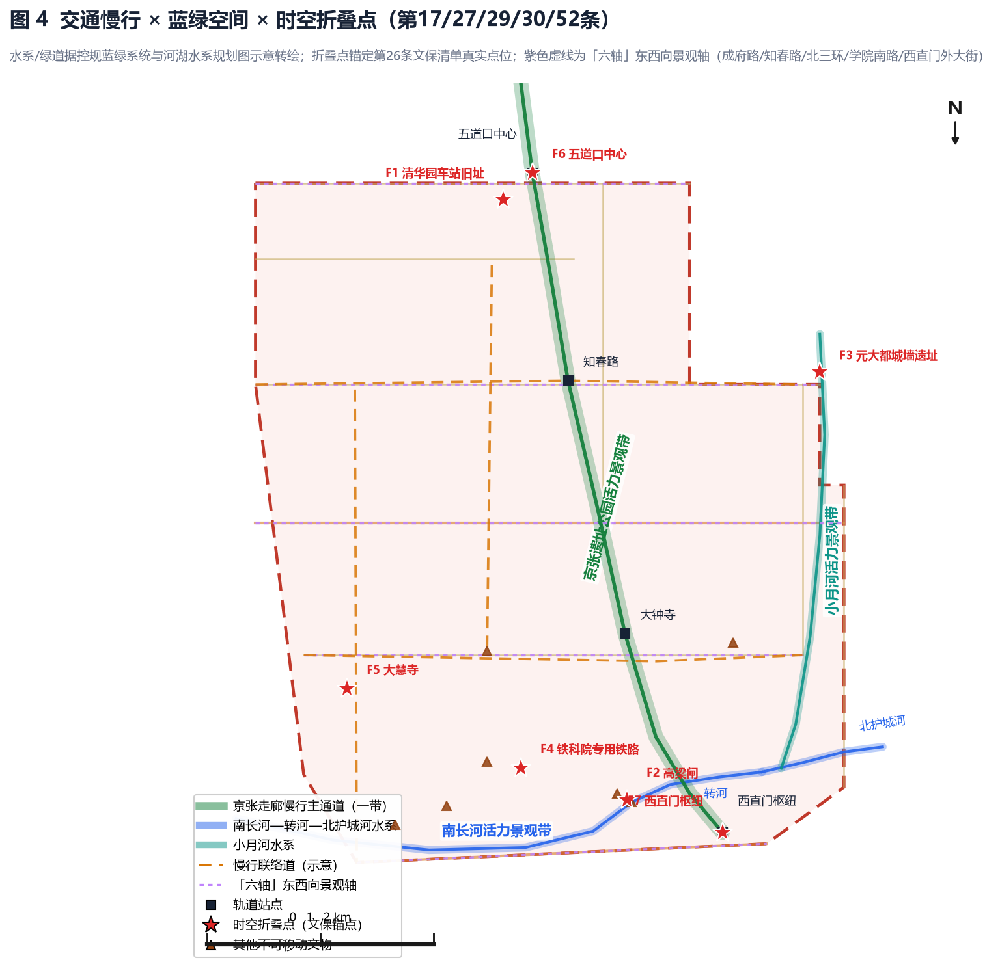
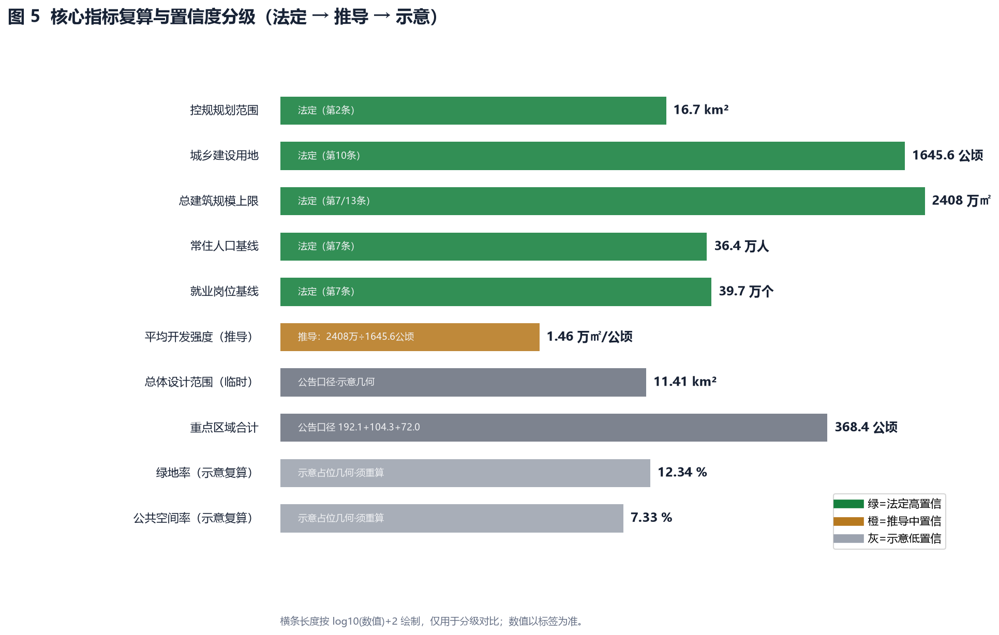

# Fold Jingzhang

**Jingzhang Data-Spatial Fold Belt (JDSFB)**

This proposal elevates the ~9 km Jingzhang Railway heritage corridor, running from the 2nd to the 5th Ring Road in Haidian, from a "physical transport line" into a "data-element circulation line" and a "carrier of time-space memory": the heritage park forms the fold belt itself (physical layer), a 1+3+N digital-twin base forms the editable city (digital layer), and 7 time-space fold nodes anchored to the statutory heritage list form the experience interface (experience layer) — together a "computable, perceivable, editable" urban renewal demonstration belt. All rigid conclusions are benchmarked against the statutory *HD00-1601 et al. Block Regulatory Detailed Plan (2024–2035)* [source:REGULATORY-PLAN-HD00-1601], industry facts against the official "Three Zones, Two Wings" release [source:THREE-ZONES-TWO-WINGS-RELEASE], and tasks against the open-call announcement and the agent-facing taskbook [source:OFFICIAL-ANNOUNCEMENT] [source:AGENT-TASKBOOK].

## Design Basis and Source Inventory

The primary basis of this formal submission is the official prequalification announcement issued by the Haidian Branch of the Beijing Municipal Commission of Planning and Natural Resources [source:OFFICIAL-ANNOUNCEMENT], with the maintainer-registered provisional boundaries, key areas, enums, metrics and source lists in `brief/site-package/` as machine-readable basis [source:SITE-PACKAGE]. Before generating the design, the agent read `design_brief.json`, `sources.json`, `enums/`, `data/source_registry.json` and `data/processed/agent_fact_pack.md`; every design judgement is decomposed into traceable sources, recalculable metrics, verifiable layers and human-reviewable assumptions [depth:existing_conditions_diagnosis].

Compared with other entries, this proposal additionally obtained and cites in full two key documents:

1. **Statutory regulatory plan**: *Regulatory Detailed Plan (Block Level) for HD00-1601 et al. Blocks along the Jingzhang Railway Heritage Park (AI Innovation Block Key Area), Haidian District, Beijing (2024–2035)* (prepared by CAUPD, qualification no. 21110023) [source:REGULATORY-PLAN-HD00-1601]. Its rigid controls — a 16.7 km² planning area (Chengfu Road to the north, Xizhimenwai Street to the south, Zhongguancun Street to the west, Xinjiekouwai Street to the east; 9 blocks), a 24.08 million sqm total floor-area ceiling, ~364,000 permanent residents, ~397,000 jobs, the statutory structure "one belt, one axis, two centers, multiple nodes", 75 dominant-function zones, 6 baseline height classes, and 13 immovable heritage sites — take precedence over any competition narrative; every spatial conclusion of this proposal is checked item by item (see `[source:Regulatory Plan Art. N]` annotations throughout).
2. **Official "Three Zones, Two Wings" release**: Haidian's official release on the centennial Jingzhang AI innovation belt, defining Xuebeiyuan AI Acceleration Zone (north), Beijing AI Origin Community (center), Dazhongsi AI Industry Cluster (south), the Zhongguancun tech-services wing (west) and the Xiaoyue River scenario wing (east), together with all industry facts [source:THREE-ZONES-TWO-WINGS-RELEASE].

Usage boundaries of the source registry [source:SOURCE-REGISTRY]:

- `data/source_registry.json` registers the usability of public, cleared and provisional materials; the agent must not upgrade background-only or provisional-only materials into official boundaries, statutory plans, formal scoring basis or government implementation commitments.
- `data/processed/agent_fact_pack.md` is a reading-navigation layer, not a new authority [source:PROCESSED-FACT-PACK]; factual judgements return to registered primary materials, and full source relations are kept in `sources.json`.
- Parts 2 and 3 of the regulatory plan (drawings and block charts) are image-based and could not be text-extracted; the resulting parcel-level precision limit is registered in `assumptions.json`. This proposal cites only textual clauses and never fabricates chart geometry [source:REGULATORY-PLAN-HD00-1601].

Because official `SITE_BOUNDARY` and `KEY_AREA` geometry has not been published, this proposal uses provisional boundaries derived from `brief/site-package/geometry/provisional_boundaries.geojson` [source:BOUNDARY-SOURCE] [source:KEY-AREA-SOURCE]. `geometry/site_boundary.geojson` and `geometry/key_areas.geojson` are marked `provisional_constraint`, `official_boundary=false`; they serve generation, self-check, visualization and design discussion only — never as official redlines, approval basis or precise-area basis. This organizer data gap does not block content scoring; all layers and metrics will be recalculated once official geometry is published. The provisional boundary has been cross-checked against the regulatory plan's four boundary roads and 9 block codes; the area-caliber difference (11.4 km² overall design area vs 16.7 km² regulatory area) is registered in `assumptions.json` [data:geometry/site_boundary.geojson#SITE-001] [metric:site_area_sqm].

## Three-Level Scope Framework

The proposal is organized along the announcement's three levels, with the nested calibers disclosed: 43.6 km² strategic research scope (AI industry ecology, positioning, future urban form) ⊃ ~37 km² comprehensive planning scope (official release caliber) ⊃ 16.7 km² regulatory key area (statutory benchmark) ⊃ ~11.4 km² overall design area (announcement task caliber, 1–2 km around the heritage park) ⊃ 368.4 ha of three key detailed-design areas [source:OFFICIAL-ANNOUNCEMENT] [source:REGULATORY-PLAN-HD00-1601]. Caliber differences are registered in `assumptions.json`. Every mandatory task of announcement 1.3/1.4/1.5 and agent.1–agent.6 is mapped in `compliance_matrix.json` to sections, layers, metrics, drawings and HTML evidence [depth:three_level_scope_framework] [standard:PROJECT-OFFICIAL-ANNOUNCEMENT].

The overall concept is the **Jingzhang Data-Spatial Fold Belt (JDSFB)**: one "fold" presses the 1909 railway heritage and the 2035 AI district into the same spatial coordinate — the physical layer keeps the railway fabric and implants modular, detachable "AI urban plug-ins"; the digital layer builds an "editable city base" linking the three zones into a data-assetization test belt; the experience layer overlays centennial railway scenes and future AI visions onto statutory heritage anchors via AR/MR. "Folding" is not a formal metaphor but the operating mechanism by which data elements circulate, register, trade and feed back in physical space (see the Jingzhang Data Covenant section).

| Level | Design question | Proposal answer | Data anchor |
| --- | --- | --- | --- |
| Strategic research scope | How to organize AI industry ecology and future urban form | "university sourcing – open-source collaboration – enterprise conversion – public experience – global communication" innovation chain + JDSFB three-layer fold structure | compliance_matrix.json, standard_matrix.json |
| Overall design area | How industry, renewal, transport and character land on the map | Land-use, building, road, green, public-space and phasing layers plus the data-node network | [data:geometry/land_use.geojson#LU-001], [data:geometry/roads.geojson#ROAD-001] |
| Key areas | How the three zones reach detailed-design depth | Positioned as Data Origin / Fold Hub / Exchange Port, overlaid with 7 fold nodes | [data:geometry/key_areas.geojson#PROV-KEY-001], [data:geometry/public_space.geojson#FOLD-001] |

## Strategic Research: Industry and Future Urban Form

The core task at this level is building a world-class AI innovation ecosystem. Per the official release, Haidian already hosts 2,000+ AI enterprises, 26 unicorns, 130 registered foundation models, an AI core industry exceeding RMB 350 billion, 95,000 AI R&D talents, and 30+ universities and institutes nearby [source:THREE-ZONES-TWO-WINGS-RELEASE]. The regulatory plan further registers 9 existing universities (UCAS, BJTU, BUPT, BNU, etc.), some earmarked for relocation to Yanqing and Xiong'an; the vacated campus space will fill regional gaps — the statutory source of JDSFB's "opportunity-space inventory" [source:REGULATORY-PLAN-HD00-1601] (Art. 6).

JDSFB organizes these facts into a "one spine, two faces" fold structure: the three zones form the longitudinal spine (data elements originate → process → circulate), while the two wings form the east-west unfolding faces (service enablement × scenario validation) [depth:overall_spatial_structure] [standard:PROJECT-AGENT-OPEN-CALL-TASKBOOK]:

| Key zone | Official positioning and facts | JDSFB theme | Functional overlay |
| --- | --- | --- | --- |
| North · Xuebeiyuan AI Acceleration Zone | Dongsheng Science Park Xuebeiyuan campus, 238,300 sqm GFA, opened July 2026, NSFC signed in; national computing base, AI chips, foundational algorithm platforms, 1,200 sqm exhibition space, AI go-global service platform [source:THREE-ZONES-TWO-WINGS-RELEASE] | **Data Origin** | Urban data sandbox, edge-computing cluster, vertical-model training ground, Algorithm Contribution Index HQ (computing × data dual base) |
| Center · Beijing AI Origin Community | Wudaokou core, ringed by Tsinghua–Peking–CAS; 320+ AI firms, >74% industry concentration, >70% young R&D staff; "5+5" rent and computing subsidies, 15-minute talent living circle [source:THREE-ZONES-TWO-WINGS-RELEASE] | **Fold Hub** | Editable-city demonstration zone, AR/MR time-space narrative nodes, developer co-creation community, smart-station network |
| South · Dazhongsi AI Industry Cluster | Riding on leading platforms such as Douyin; agents, AI content consumption, smart terminals, digital cultural creativity; commercial testing and mass-production incubation [source:THREE-ZONES-TWO-WINGS-RELEASE] | **Exchange Port** | Data-asset registration and trading platform, AI-native business scenarios, industry testbeds, digital-twin showcase |
| West wing · Zhongguancun Tech-Services | Global factor connector: VC, IP, cross-border commerce, legal, IPO coaching | Service face | Business and legal interface of the Data Covenant: data-asset registration, compliance review, cross-border data-flow consulting |
| East wing · Xiaoyue River Scenario | Smart-city testbed: embodied AI, AI healthcare, digital film production, smart tourism pilots | Scenario face | Field-application outlet for data elements: adaptive public space, affective computing, AI guides tested first along the waterfront |

The naming system serves the identity of "centennial Jingzhang culture belt, urban AI living-experience belt, AI-fusion innovation belt": full Chinese name 京张数智折叠带, English Jingzhang Data-Spatial Fold Belt (JDSFB); the logo overlays data flows and folded surfaces on railway-track lines, forming a "physical track × digital fold" composite symbol. The master visual uses a "center-seam fold, two eras facing each other" composition — the left half a yellowed 1909 engineering blueprint (steam locomotive, old platform, water-tower silhouettes), the right half a deep-blue digital twin (AI light-particle train, edge-node nebula), with one railway crossing the seam to complete the time travel (see `assets/figures/cover.png`). Our future-urban-form conclusion: AI changes not only industrial efficiency but "how time is used" — commuting, collaboration, consumption and learning are compressed into one slow-mobility corridor; that is the urban meaning of "folding". Content on global AI events and developer-community operation is conceptual suggestion for professional teams, not a government commitment.

## Overall Design Area: Urban Renewal at Regulatory-Plan Depth

The overall design area must reach the urban-design depth of a regulatory detailed plan. This proposal aligns directly with the statutory structure "one belt, one axis, two centers, multiple nodes" (Art. 9) [source:REGULATORY-PLAN-HD00-1601] [standard:MOHURD-CONTROL-DETAILED-PLANNING] [depth:overall_spatial_structure]:

| Statutory structure | Content | JDSFB alignment |
| --- | --- | --- |
| One belt | Jingzhang Railway Heritage Park industry-innovation belt | The fold belt itself — physical heritage corridor × digital data corridor |
| One axis | Zhongguancun Street innovation axis | Service-interface corridor of the Data Covenant (west wing) |
| Two centers | Wudaokou center, Dazhongsi center | Wudaokou = Fold Hub core; Dazhongsi = Exchange Port core |
| Multiple nodes | Zhichun Road, Sidaokou (tier 1); Haidian Huangzhuang, Digital Building, Zaojunmiao, Zhichun Rd West, Yingu, Xitucheng, BUPT (tier 2) | Anchor pool for edge nodes and fold nodes |

The renewal framework responds to the official "nearly 10 million sqm of stock space + 1 million sqm renewal carrier" caliber [source:THREE-ZONES-TWO-WINGS-RELEASE]: underused space is identified against the 75 dominant-function zones (26 residential-led, 16 culture/education-led, 17 mixed-use, 6 green/water-led, etc.; Art. 12); renewal intensity never exceeds the five-tier baseline intensity zoning (Art. 14); building heights strictly observe the six baseline height classes of 36/45/60/80/100 m (Art. 16). `geometry/land_use.geojson` covers the design boundary completely without overlaps [data:geometry/land_use.geojson#LU-001] [depth:land_use_layout]; `geometry/buildings.geojson` expresses renewal building footprints [data:geometry/buildings.geojson#BLDG-001] [metric:building_footprint_area_sqm]; intensity control is governed by [depth:development_intensity_controls].

### Jingzhang Data Covenant and Algorithm Contribution Index (statutory source: Art. 82)

Article 82 of the regulatory plan explicitly calls to "explore reform paths for market-based allocation of data elements" [source:REGULATORY-PLAN-HD00-1601]. JDSFB deepens this statutory clause into an implementable "Jingzhang Data Covenant":

- **Three-tier public-data authorization list**: L1 open tier (anonymized aggregate city-operation data, no authorization needed), L2 authorized tier (district-level sensing data, application after enterprise KYC), L3 sandbox tier (sensitive-scenario data, usable-but-invisible inside the Xuebeiyuan data sandbox only); target coverage at [metric:data_covenant_coverage_ratio].
- **Algorithm Contribution Index**: enterprises and developers trade city-optimizing algorithms for data-use rights; index = model invocation frequency × scenario weight × effect score (baseline and formula at [metric:algorithm_contribution_index]); top contributors receive a spatial reward ladder (testbed priority → showcase slots → rent-reduction recommendations).
- **Compliance floor**: enterprise KYC, data de-identification, purpose registration and auditable logs are all indispensable; the index is an operational proposal, not government approval or commitment.

### 1+3+N Digital-Twin Architecture (aligned with Art. 82 intelligent-city system)

"1" city-level data lake (Xuebeiyuan, on the national computing base); "3" district edge nodes (one per zone, local real-time computing and privacy de-identification); "N" street-level pluggable AI models and sensing nodes (modular temporary facilities, exempt from height zoning, marked detachable). Open APIs with de-identification-first interfaces; node locations at [data:geometry/public_space.geojson#DATA-001] [metric:data_nodes_count]. All edge nodes and sensors avoid the plan's underground no-build zones (heritage protection areas and class-1 construction-control belts) [source:REGULATORY-PLAN-HD00-1601].

## Key Area Detailed Design

The three key areas reference provisional boundaries [data:geometry/key_areas.geojson#PROV-KEY-001], [data:geometry/key_areas.geojson#PROV-KEY-002], [data:geometry/key_areas.geojson#PROV-KEY-003], with depth governed by [depth:three_key_area_detailed_design] and compliance items 1.5.3.1–1.5.3.3. **Caliber note**: Xuebeiyuan lies outside the regulatory-plan area (which ends at Chengfu Road) and is treated at strategic-research level; regulatory-depth design covers only Wudaokou (Origin Community) and Dazhongsi. The announcement's "Zhongzhiyuan AI Acceleration Zone" (item 1.5.3.1) and the official release's "Xuebeiyuan AI Acceleration Zone" are the same zone; this proposal uses "Xuebeiyuan (announcement caliber: Zhongzhiyuan)".

| Key zone | Positioning | Spatial actions | AI industry & operation scenarios | Evidence |
| --- | --- | --- | --- | --- |
| Xuebeiyuan AI Acceleration Zone | Data Origin · garden-style full-stack innovation block | Strengthen Qinghe interface, industry showcase, low-carbon exchange; concentrated sandbox and computing base | Urban data sandbox, sovereign-model testing, standards workshops, safety-governance showcase | [data:geometry/key_areas.geojson#PROV-KEY-001] |
| Beijing AI Origin Community | Fold Hub · near-campus tech-transfer and talent community | Slow-mobility stitching of campus–park–blocks; editable-city demonstration zone; Qinghuayuan Station main fold node | Open-source community, achievement launches, talent-zone services, AR/MR time-space narratives | [data:geometry/key_areas.geojson#PROV-KEY-002] |
| Dazhongsi AI Industry Cluster | Exchange Port · urban intelligent-economy and international-exchange block | Dazhongsi station integration, four-quadrant pedestrian connection, data-asset trading carrier renewal | Data-asset registration/trading, agent & smart-terminal showcase, international roadshows | [data:geometry/key_areas.geojson#PROV-KEY-003] [metric:key_area_count] |

### 7 Time-Space Fold Nodes (all anchored to the statutory heritage list and key areas)

Per the immovable-heritage list of Art. 26, the spatial structure of Art. 9 and the tier-2 key-area controls of Arts. 21–23 (heritage-park frontage, South Long River frontage, Xizhimen hub), all 7 fold nodes are re-anchored to statutory assets; the scaffold's fictional nodes (old platform, water tower, switches) are discarded. National- and municipal-level heritage sites allow AR/MR "experience overlay" only — no physical alteration whatsoever (including sensor installation) — and protection areas and construction-control belts are strictly observed [source:REGULATORY-PLAN-HD00-1601]:

| ID | Anchor | Statutory level | History layer | Future layer (AR/MR overlay) | Location |
| --- | --- | --- | --- | --- | --- |
| FOLD-001 | Qinghuayuan Railway Station site | Beijing municipal heritage | 1910 Jingzhang Railway Qinghuayuan Station, built under Zhan Tianyou | **Main fold node**: "AI guide Zhan Tianyou" — an LLM revives the historical narrator; first stop of the time-travel route | [data:geometry/public_space.geojson#FOLD-001] |
| FOLD-002 | Gaoliang Sluice | National heritage | Yuan-dynasty Tonghui River sluice, canal artery | Water wisdom across eras: AR overlay of canal water systems and contemporary sponge-city data | [data:geometry/public_space.geojson#FOLD-002] |
| FOLD-003 | Yuan Dadu city-wall ruins | National heritage | Yuan-dynasty northern wall, an 800-year-old city outline | Wall time-section: MR show of urban-boundary growth | [data:geometry/public_space.geojson#FOLD-003] |
| FOLD-004 | CARS research railway | Ungraded heritage | New China's railway research test line | Unique "data folding" asset: track × research history, experimental-data visualization gallery | [data:geometry/public_space.geojson#FOLD-004] |
| FOLD-005 | Dahui Temple | National heritage | Ming-dynasty temple, painted-sculpture treasury | Digital-sculpture research display (remote projection, no contact with the monument) | [data:geometry/public_space.geojson#FOLD-005] |
| FOLD-006 | Wudaokou center | Statutory "two centers" | Contemporary youth-culture landmark | Fold Hub lounge: developer co-creation, premieres, night-time data carpet | [data:geometry/public_space.geojson#FOLD-006] |
| FOLD-007 | Xizhimen hub | Statutory tier-2 key area | Centennial Jingzhang origin gateway | South portal of the fold: arrival ritual, city-data overview screen | [data:geometry/public_space.geojson#FOLD-007] |

Fold-node count at [metric:fold_nodes_count]; AR/MR experience points at [metric:ar_mr_experience_points]. Node coordinates are now schematically calibrated to the actual heritage sites: FOLD-001/006 sit at the northern edge of the provisional design corridor, while FOLD-002/003/004/005/007 lie within the statutory 16.7 km² plan area (FOLD-003 Yuan Capital Wall and FOLD-005 Dahui Temple fall outside the provisional corridor, inside the wider study area). All nodes use the statutory plan area as the spatial benchmark and are linked across scopes by the data covenant, unconstrained by the provisional corridor; siting follows the "north–south through, east–west integrated" public-space requirement of the tier-2 key area along the heritage park (Art. 21) [source:REGULATORY-PLAN-HD00-1601].

### Fold-Node Scene Renderings (illustrative)

The following scenes follow the "center-seam fold, two eras facing each other" visual system: the left half shows the 1909 history layer in silhouette, the right half the 2035 future layer as an AR/MR concept. These renderings express design intent only — they are not site photographs; all experiences are digital overlays with no physical alteration of heritage [depth:three_key_area_detailed_design].

## AI Innovation Ecosystem, Talent Profiles and AI+ Scenarios

The proposal builds spatial-demand profiles for AI talent and enterprises — R&D offices, open-source collaboration, launches, enterprise services, housing, social learning, consumption, sports and international exchange — aligned with Art. 83 ("innovation cluster focused on AI, internet services and new media" and "smart, efficient, city-green interwoven, vitality-shared urban innovation blocks") [source:REGULATORY-PLAN-HD00-1601]. AI+ scenarios land on concrete layers with governance boundaries: public-space scenarios reference [data:geometry/public_space.geojson#PUBLIC-001], slow-mobility scenarios [data:geometry/roads.geojson#ROAD-001], open-space scenarios [data:geometry/green_space.geojson#GREEN-001] and [metric:public_space_ratio], [metric:green_ratio].

| User profile | Typical needs | Spatial response | Self-check boundary |
| --- | --- | --- | --- |
| Open-source developers (>70% young R&D staff in the Origin Community [source:THREE-ZONES-TWO-WINGS-RELEASE]) | Release, collaboration, testing, reputation | Fold Hub open-source launch hall, public code wall, night collaboration space | No personal trajectory collection; activity data aggregated only |
| Startup teams | Low-cost offices, computing access, testbeds | Xuebeiyuan shared testbed, edge-computing service points, standards & governance consulting | Computing and data services require separate authorization |
| Leading-enterprise visitors | Showcase, business, international reception, recruitment | Dazhongsi international roadshow lounge, rail-station connections, public space around key enterprises | Enterprise logos and cases must be rights-cleared |
| Nearby residents (statutory baseline [metric:population_baseline]) | Commuting, leisure, community services, low-disturbance renewal | Heritage-park slow loop, community-lounge embedding, graded night lighting and events | Resident profiles never used for commercial recommendation |
| University faculty and students (9 statutory universities) | Tech transfer, cross-campus collaboration, daily slow mobility | Campus–park slow stitching, tech-transfer stations, AI education experience points | Campus data and research results require authorization |

| Scenario card | Spatial carrier | Description |
| --- | --- | --- |
| 01 Urban data sandbox | Xuebeiyuan | Vertical-model training on the national computing base; public-data authorization pilot (Covenant L3) |
| 02 Open-source launch hall | Beijing AI Origin Community | Launches, code-contribution showcase and mini-roadshows for universities, communities and startups |
| 03 Edge-computing station | Nodes across the overall design area | 1+3+N street-level node prototype combined with public services and low-carbon energy |
| 04 AI slow-mobility navigation | Heritage-park vitality belt | Explainable wayfinding and low-intrusion sensing for breakpoints, crowding and accessibility |
| 05 Dazhongsi international roadshow lounge | Dazhongsi AI Industry Cluster | Showcase, negotiation, media launch and international exchange for agent/terminal/content firms |
| 06 Demand-responsive & autonomous bus feeder | Rail stations and corridor nodes | Implements the plan's characteristic-bus clause (Art. 52) with AI-dispatched micro-circulation feeders [source:REGULATORY-PLAN-HD00-1601] |
| 07 Adaptive public space | Xiaoyue River wing first | Plazas and streets auto-adjust lighting, seating and functions by footfall, weather and events; target ratio at [metric:adaptive_public_space_ratio] |
| 08 AI historical narration | 7 fold nodes | LLM-revived historical figures such as Zhan Tianyou as AI guides telling the centennial Jingzhang story |
| 09 Affective-computing public space | East-wing waterfront + community lounges | Real-time sensing of crowd emotion and needs, dynamic environmental tuning, linked to AI+ elderly care |
| 10 Embodied AI & AI healthcare pilots | Xiaoyue River waterfront | Echoing the official "smart-city testbed" positioning: AI+ livelihood, culture/entertainment and elderly-care applications [source:THREE-ZONES-TWO-WINGS-RELEASE] |

### Ethics and Data Governance

Sensing data is processed locally (de-identified inside district edge nodes before uplink); public notice and opt-out mechanisms (scenario nodes disclose collection scope and purpose, with physical opt-out channels); algorithm auditing and bias detection (fairness assessment inside the Algorithm Contribution Index review). Urban agents may assist in identifying slow-mobility breakpoints, public-space heat, facility maintenance, enterprise-service demand and event-safety risks, but cannot replace planning approval, cannot output unauthorized personal profiles, and cannot claim government implementation commitments. All AI scenario nodes enter structured layers or the compliance matrix so reviewers can verify their relation to industry, space and public interest.

## Land Use, Building Scale and Retain-Renovate-Demolish Plan

Land use follows public standards for territorial-space survey, planning and use-control classification [standard:MNR-LAND-USE-CLASSIFICATION-GUIDE], forming complete, closed, seamless zoning [data:geometry/land_use.geojson#LU-001]. Buildings are classified as retained / renovated / renewed / new; height, massing, interface and character controls are governed by [depth:height_massing_character]; the retain-renovate-demolish method is governed by [depth:retain_renovate_demolish] and aligned with the plan's "retain, renovate, demolish, supplement" strategy (Art. 84) [source:REGULATORY-PLAN-HD00-1601].

**Rigid scale constraint**: under no scenario may total floor area exceed the statutory ceiling of 24.08 million sqm [metric:total_floor_area_ceiling_sqm] (Arts. 7/13); the statutory FAR baseline is ~1.46 (24.08 million sqm ÷ 16.456 million sqm urban construction land, formula and plan basis annotated) [metric:statutory_floor_area_intensity]; building footprint ratio within the submitted site [metric:floor_area_ratio]. Population and employment simulation baselines use statutory values: ~364,000 residents [metric:population_baseline] and ~397,000 jobs [metric:employment_baseline]. For parcel-level height, intensity and setback indicators — unreadable because the plan charts are not digitized — all conclusions are marked "subject to confirmation of official chart conditions" and never presented as approved values (registered in `assumptions.json`).

## Transport, Rail, Municipal and Public-Service Facilities

Transport aligns with statutory clauses: rail-station integration control (Art. 36) and rail micro-centers (appropriately higher development intensity and mixed use, Art. 37), the "rail + green transfer" system (Art. 51), and demand-responsive/autonomous characteristic buses (Art. 52, embedded in scenario card 06) [source:REGULATORY-PLAN-HD00-1601] [depth:traffic_rail_slow_parking]. Focus covers the North 5th Ring Road, heritage-park ring-road crossings, Wudaokou, Qinghua East Road West Entrance, Dazhongsi station and links around key enterprises; road and slow-mobility layers stay inside the submitted boundary and are cross-checked with public space, green space and industry nodes [data:geometry/roads.geojson#ROAD-001] [data:geometry/public_space.geojson#PUBLIC-001].

Municipal and public-service facilities implement the plan's special coordination: storm-sewage separation (100% storm-drain coverage in built-up areas by 2035, Art. 58), distributed PV (Art. 60), and multi-network fused 5G (Art. 63), integrated with JDSFB new infrastructure (distributed energy, edge computing, edge nodes) [depth:municipal_new_infrastructure]. Sponge-city management follows the statutory annual-runoff-capture zoning (≥85% along waterfronts and the heritage-park corridor, 75–85% in transition zones, 65–75% in general built-up areas, per Art. 67 and the sponge-city plan map); JDSFB stormwater detention nodes are sited first where the ≥85% zone meets blue-green corridors. Facility standards, service radii, operation models and phasing logic are stated; missing engineering data — pipelines, energy, drainage, flood control (South Long River–Zhuan River and North Moat at 100-year, Tucheng Gou at 50-year, Art. 27), fire protection — are listed as preconditions for formal deepening [data:geometry/constraints.geojson#CONSTRAINTS].

## Blue-Green Space, Public Space and Urban Character

Blue-green space implements the statutory "three belts, six axes, multiple corridors and centers" landscape structure: the three vitality landscape belts of the Jingzhang Railway Heritage Park, South Long River and Xiaoyue River (Art. 17) [source:REGULATORY-PLAN-HD00-1601] [depth:blue_green_public_space]. With the heritage-park vitality belt as the backbone, the proposal delivers a north–south through, east–west connected system of walkways, bikeways and green space, identifying slow-mobility breakpoints, ring-road crossings and the park's north/south gateway nodes [data:geometry/green_space.geojson#GREEN-001] [data:geometry/public_space.geojson#PUBLIC-001]. Recalculable green and public-space ratios are given at [metric:green_ratio] and [metric:public_space_ratio] respectively.

Public space implements the statutory garden-city scenes (Art. 33), 8 community lounges (5-minute walking circles, Art. 38), the four-tier recreation system (specialty parks, composite public spaces, community parks, pocket parks, Art. 29) and the three-level greenway network (city–district–community, Art. 30); JDSFB adaptive public spaces are tested first at community lounges and pocket parks. Urban character follows the four statutory character zones (innovation core, university research, livable residential, waterfront vitality) and five street-type controls, fusing Jingzhang railway culture, Zhongguancun innovation culture and AI innovation culture [standard:MOHURD-URBAN-DESIGN-MEASURES]. The AI pilgrimage-landmark system = 7 fold nodes + the "折" (fold) visual symbol + the Algorithm Contribution honor wall (names displayed only with consent); all brands, fonts, images, portraits and enterprise logos are rights-cleared; character controls distinguish statutory controls, design suggestions and to-be-confirmed conditions, with no pseudo-precise control lines.

## Renewal Project List, Implementation Policy and Phasing

The project list aligns with the plan's implementation strategy and adaptive provisions (Arts. 84–88: floor management for the three major facility types, green plazas and water areas; park green plazas may shift position and shape within dominant-function zones; branch-road alignments may be optimized) [source:REGULATORY-PLAN-HD00-1601] [depth:renewal_project_list] [depth:phasing_implementation]; phasing geometry at [data:geometry/phasing.geojson#PHASE-001].

| ID | Project | Type | Key dependencies | Evidence |
| --- | --- | --- | --- | --- |
| JZ-01 | Heritage-park slow-mobility breakpoint stitching | Public space / transport | Road redlines, under-bridge space, traffic review | [data:geometry/roads.geojson#ROAD-001] |
| JZ-02 | Xuebeiyuan data sandbox & Qinghe innovation interface | New infrastructure / blue-green | Computing-base carrier, river blue line, ecology & flood control | [data:geometry/green_space.geojson#GREEN-001] |
| JZ-03 | Origin Community Fold Hub & near-campus tech-transfer street | Urban renewal / industry services | Campus boundary, ownership, ground-floor uses | [data:geometry/buildings.geojson#BLDG-001] |
| JZ-04 | Dazhongsi station four-quadrant pedestrian connection & data-asset trading lounge | Rail integration / slow mobility | Rail station, intersections, municipal pipelines | [data:geometry/public_space.geojson#PUBLIC-001] |
| JZ-05 | 1+3+N digital-twin base & edge-computing nodes | New infrastructure / public services | Energy, computing, security, operating entities | [data:geometry/public_space.geojson#DATA-001] |
| JZ-06 | AR/MR experience works at 7 fold nodes | Culture-tech / operation | Heritage-authority approval (overlay only), content clearance | [data:geometry/public_space.geojson#FOLD-001] |
| JZ-07 | Jingzhang Data Covenant operation platform | Data elements / governance | Art. 82 implementation path, enterprise KYC and audit | [metric:data_covenant_coverage_ratio] |
| JZ-08 | Global AI Week public route | Operation / branding | Public-space permits, event safety, copyright clearance | [data:geometry/phasing.geojson#PHASE-001] |

Phasing is distinguished from the 100-day competition period: near-term pilots (JZ-01, JZ-06, JZ-08 — lightweight facilities and operations first), mid-term renewal (JZ-02–JZ-05 — pending official charts, municipal, transport and ownership conditions), long-term governance (JZ-07 — iterative Data Covenant operation). Three operating mechanisms: data-asset registration and trading (AI firms trade algorithm contributions for data-use rights), the Urban Algorithm Contribution Index (city-optimizing models receive policy or spatial rewards), and time-space narrative co-creation (open historical-data interfaces encouraging AI games, films and art on Jingzhang history) — all operational proposals with explicit responsibility boundaries, conversion paths and risks, not government event commitments.

## Metric System, Area Recalculation and Compliance Matrix

Metrics fall into three classes [depth:metrics_recalculation]: (1) directly recalculable from submitted geometry (boundary area, green/public-space ratios, building footprint, key-area count, fold/data-node counts); (2) supported by statutory documents (floor-area ceiling, FAR baseline, population and employment baselines — all from the regulatory plan); (3) calibrated in operation (Algorithm Contribution Index, covenant coverage, adaptive-space ratio, scenario usage frequency). All known metrics are reproducible from GeoJSON or registered sources; full values, formulas and confidence levels live in `metrics.json`; `scripts/spatial_review.py` and `scripts/visual_review.py` outputs serve as formal self-evidence.

| Metric | Value / status | Class | Basis |
| --- | --- | --- | --- |
| Overall design area [metric:site_area_sqm] | ~11.413 million sqm (provisional) | 1 | [data:geometry/site_boundary.geojson#SITE-001] |
| Building footprint [metric:building_footprint_area_sqm] | ~0.311 million sqm | 1 | [data:geometry/buildings.geojson#BLDG-001] |
| Green ratio [metric:green_ratio] / public-space ratio [metric:public_space_ratio] | 12.3% / 7.3% | 1 | [data:geometry/green_space.geojson#GREEN-001] |
| Key-area count [metric:key_area_count] | 3 | 1 | [data:geometry/key_areas.geojson#PROV-KEY-001] |
| Fold nodes [metric:fold_nodes_count] / data nodes [metric:data_nodes_count] | 7 / 12 | 1 | [data:geometry/public_space.geojson#FOLD-001] |
| Statutory floor-area ceiling [metric:total_floor_area_ceiling_sqm] | 24.08 million sqm | 2 | Plan Arts. 7/13 [source:REGULATORY-PLAN-HD00-1601] |
| Statutory FAR baseline [metric:statutory_floor_area_intensity] | ~1.46 (derived) | 2 | Plan Art. 7 |
| Building footprint ratio [metric:floor_area_ratio] | ~2.72% | 1 | [data:geometry/buildings.geojson#BLDG-001] |
| Population [metric:population_baseline] / employment [metric:employment_baseline] baselines | 364k / 397k | 2 | Plan Art. 7 |
| Algorithm Contribution Index [metric:algorithm_contribution_index] | Calibrated in operation | 3 | Plan Art. 82 implementation proposal |

The compliance matrix is the master task-responsiveness file: every mandatory task of announcement 1.3/1.4/1.5 and agent.1–agent.6 maps to sections, layers, metrics, drawings, HTML, sources, assumptions and self-checks; the regulatory-plan compliance module maps the 16.7 km² area, 24.08 million sqm ceiling, 6 height classes, 75 dominant-function zones, 13 heritage sites, three-belt-six-axis structure and two-center-multiple-node structure item by item to sections and layers, each annotated `[source:Regulatory Plan Art. N]`.

## Risks, Copyright and Compliance

**Bilingual requirement.** The master proposal is Chinese, with a complete English counterpart in `proposal.en.md`; A3/A0 drawings, HTML and text-bearing figures all have corresponding language versions, preferably using the competition's recommended translations in `docs/terminology-glossary.md`. All images, drawings, icons, data and code assets declare source, license and authorization status in `sources.json` or `report/copyright_statement.md`. HTML pages load no remote scripts, map tiles, fonts, iframes, forms or external APIs, and do not track reviewers.

Risks and data gaps are checked jointly by the risk depth item, the constraints layer and the site package [depth:risk_missing_data] [data:geometry/constraints.geojson#CONSTRAINTS] [source:SITE-PACKAGE]. Key risks: official boundary and key-area polygons not yet published (fallback: provisional boundary + cross-check against the plan's boundary roads); plan charts not digitized (fallback: cite textual clauses only, parcel-level conclusions downgraded to to-be-confirmed); floor-area overrun risk (control: 24.08 million sqm written into generation constraints and self-checks); heritage no-build risk (control: overlay-only at heritage sites, no sensors inside protection areas or class-1 control belts, no data nodes in underground no-build zones) [source:REGULATORY-PLAN-HD00-1601].

This proposal claims no official approval, no approved regulatory plan, no final land ownership, no final construction scale and no guaranteed implementation. The AI agent is responsible for facts, sources, copyright, spatial data, metrics and expression; maintainers and professional reviewers may request revisions or reject based on self-check results, spatial review and the compliance matrix. Architectural design-depth provisions activate once official documents are obtained; they are currently managed as a data-gap item [standard:MOHURD-ARCH-DESIGN-DEPTH-2016].

## References

- *HD00-1601 et al. Block Regulatory Detailed Plan (2024–2035)*, textual clauses [source:REGULATORY-PLAN-HD00-1601]
- Official "Three Zones, Two Wings" release (centennial Jingzhang AI belt industry facts) [source:THREE-ZONES-TWO-WINGS-RELEASE]
- brief/public-brief.md, brief/site-package/design_brief.json, brief/site-package/enums/ [source:SITE-PACKAGE]
- data/processed/agent_fact_pack.md [source:PROCESSED-FACT-PACK]
- Open-call prequalification announcement [source:OFFICIAL-ANNOUNCEMENT], agent-facing taskbook [source:AGENT-TASKBOOK]
- Full machine index: see `sources.json`, `metrics.json`, `compliance_matrix.json`, `standard_matrix.json` and `design_depth_matrix.json`
